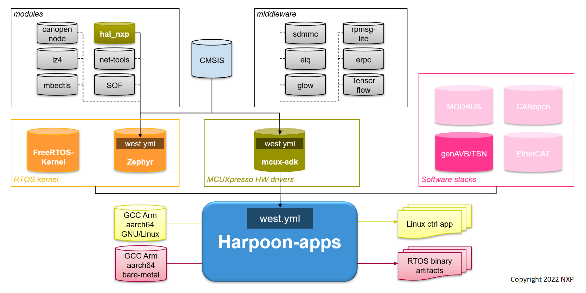

# Harpoon: Reference Applications


[](https://github.com/NXPmicro/harpoon-apps/releases/latest)
[](https://github.com/NXPmicro/harpoon-apps/graphs/contributors)

Harpoon is a Base Enablement SW platform, providing an RTOS and application specific drivers running in Linux and Jailhouse hypervisor environment, on the Cortex-A cores of NXP MPU’s (i.MX 8M Mini, i.MX 8M Nano, i.MX 8M Plus, ...).

Harpoon offers customers an environment for developing real-time demanding applications leveraging the higher performance of the Cortex-A cores (ARMv8-A) compared to the Cortex-M cores (ARMv7-M) traditionally used for RTOS based applications.

The reference applications embedded in this repository may run on several jailhouse guest RTOS (e.g.: Zephyr, FreeRTOS) leveraging the existing NXP RTOS development environment – MCUXpresso.

To ease the integration of Zephyr, mcux-sdk drivers and so on, we leveraged the [Zephyr west tool](https://docs.zephyrproject.org/latest/guides/west/index.html) which helps do multi-repository management and allow users to manage their own ```west.yml``` to select their projects.

# Overview

This project provides the fundamental support for RTOS applications running in an hypervisor environment:
* HW resource partitioning using Jailhouse hypervisor, providing an inter-ecll IPC communication
* Arm® CMSIS-CORE startup core drivers and device header files for 64-bit Cortex-A53 core
* RTOS kernel integration (FreeRTOS, Zephyr)
* Open-source peripheral drivers leveraging the MCUXpresso SDK ( [mcux-sdk project](https://github.com/NXPmicro/mcux-sdk) )
* Integration in Linux Yocto BSP as well as Real-time Edge SW Yocto through the [meta-nxp-harpoon](https://github.com/NXPmicro/meta-nxp-harpoon) layer (integration with systemd)

This project is the main repository to build the RTOS application for ARMv8-A cores, it contains the [west.yml](https://github.com/NXPmicro/harpoon-apps/blob/main/west.yml) which keeps the description and revision for other projects in the overall Harpoon delivery. Currently available software components are shown in below figure.



# Getting Started

A cross compiler is required to build Cortex-A applications ; this project is compatible with the ARM GCC toolchain that you may download and install:

```
wget https://developer.arm.com/-/media/Files/downloads/gnu-a/10.3-2021.07/binrel/gcc-arm-10.3-2021.07-x86_64-aarch64-none-elf.tar.xz
tar -C /opt/ -xvf gcc-arm-10.3-2021.07-x86_64-aarch64-none-elf.tar.xz     # (sudo permissions might be required)
```

# Cloning this repository

You need to have both Git and West installed, then execute below commands to replicate the whole Harpoon delivery at revision ```${revision}``` and place it in a west worspace named ```hww```.
```txt
west init -m https://github.com/NXPmicro/harpoon-apps --mr ${revision} hww
cd hww
west update
```
Replace ```${revision}``` with any Harpoon release you wish to use (e.g.: ```harpoon_2.0.1```). This can also be ```main``` if you want the latest state, or any commit SHA.

# Repository structure

The aim of this repository is to provide a comprehensive set of reference applications.
It provides a `west` manifest to fetch not only Zephyr, but also FreeRTOS as well as the MCUXpresso SDK (including drivers and libraries):

```txt
.
.
├── harpoon-apps
│   ├── common                              <-- source code common to all applications
│   │   ├── freertos
│   │   │   ├── boards
│   │   │   │   ├── evkmimx8mm
│   │   │   │   │   ├── armgcc_aarch64
│   │   │   │   │   │   ├── flags.cmake
│   │   │   │   │   │   ├── MIMX8MM6xxxxx_ca53_ddr_ram.ld <-- linker script
│   │   │   │   │   │   └── MIMX8MM6xxxxx_ca53_ram.ld
│   │   │   │   │   ├── board.c
│   │   │   │   │   ├── board.h             <-- board-specific board configuration for all applications
│   │   │   │   │   ├── clock_config.h
│   │   │   │   │   └── mmu.c               <-- board-specific MMU regions for all applications
│   │   │   │    ...
│   │   │   ├── common_freertos.cmake       <-- hardware-agnostic source code for FreeRTOS
│   │   │   ├── core                        <-- includes os-specific header files for the os APIs
│   │   │   │   └── armv8a
│   │   │   │       ├── common_freertos_core_armv8a.cmake
│   │   │   │       └── startup.S           <-- ARMv8-A startup code
│   │   │   ├── FreeRTOSConfig.h
│   │   │   ├── FreeRTOS_helper.c
│   │   │   ├── FreeRTOS_tick_config.c
│   │   │   ├── idle.{c,h}                  <-- implementation of idle task
│   │   │   ├── irq.{c,h}                   <-- contains interrupt handler
│   │   │   ├── mmu.h                       <-- glue with the SDK MMU driver
│   │   │   ├── os                          <-- includes os-specific header files for the os APIs
│   │   │   │   ├── assert.h
│   │   │   │   ├── counter.{c,h}
│   │   │   │   ├── semaphore.h
│   │   │   │   ├── stdio.h
│   │   │   │   └── unistd.h
│   │   │   └── os.h
│   │   ├── libs
│   │   │   └── stats
│   │   │       ├── lib_stats.cmake
│   │   │       ├── stats.c
│   │   │       └── stats.h
│   │   ├── os                              <-- includes standard/posix header files os APIs
│   │   │   ├── assert.h
│   │   │   ├── cache.h
│   │   │   ├── counter.h
│   │   │   ├── semaphore.h
│   │   │   ├── stdio.h
│   │   │   └── unistd.h
│   │   └── zephyr
│   │       ├── os
│   │       │   ├── assert.h
│   │       │   ├── counter.h
│   │       │   ├── semaphore.h
│   │       │   ├── stdio.h
│   │       │   └── unistd.h
│   │       └── os.h
│   ├── harpoon_drivers_test                <-- top directory of the application
│   │   ├── freertos
│   │   │   ├── boards                      <-- board-specific source code used for FreeRTOS
│   │   │   │   ├── evkmimx8mm
│   │   │   │   │   ├── app_board.h         <-- optional header file for application-specific board configuration definitions
│   │   │   │   │   ├── app_mmu.h           <-- optional header file for application-specific MMU regions mapping for this board
│   │   │   │   │   └── armgcc_aarch64      <-- entry point to build this application for FreeRTOS/evkmimx8mm
│   │   │   │   │       ├── build_ddr_debug.sh
│   │   │   │   │       ├── build_ddr_release.sh
│   │   │   │   │       ├── clean.sh
│   │   │   │   │       └── CMakeLists.txt
│   │   │   │    ...
│   │   │   └── main.c                      <-- main entry point for FreeRTOS
│   │   ├── include
│   │   │   └── i2c_test.h
│   │   └── src
│   │       └── i2c_test.c                  <-- hardware/os-independent source code for the application
│   ├── README.md
│   └── west.yml
├── FreeRTOS-Kernel                         <-- RTOS Kernel Git tree
├── mcux-sdk                                <-- MCUXpresso Git tree
│   ├── ...
│   ├── components
│   ├── devices
│   │   ├── <SoC>
│   │   │   ├── drivers                     <-- SoC-dependent drivers and hardware definitions
│   │    ...
│   ├── docs
│   ├── drivers                             <-- IP-dependent drivers
│   ├── middleware
│   ├── tools
│   └── utilities
└── zephyr                                  <-- Imported Zephyr module
```

# Reference Applications

The first application that you may attempt to build and execute is the `rt_latency` application.

## Compile

### FreeRTOS

If starting from a fresh console, the cross-compiler variable needs to be set:

```
export ARMGCC_DIR=/opt/gcc-arm-10.3-2021.07-x86_64-aarch64-none-elf
```

Then move to the right path, depending on the board and the RTOS that you are looking for. The example below builds the application within FreeRTOS and for the i.MX 8M Plus EVK board:

```
cd harpoon-apps/rt_latency/freertos/boards/evkmimx8mp/armgcc_aarch64/
./build_ddr_release.sh
```

The resulting binary is located under the `ddr_release/` directory and is called `rt_latency.bin`. This is the binary blob that _jailhouse_ loads into the inmate cell before starting it.

### Zephyr

Since Zephyr is installed using `west`, it is recommended to export Zephyr before building an application:

```
west zephyr-export
west build -p auto -b mimx8mp_evk_a53_1core harpoon-apps/rt_latency/zephyr
```

## Running the reference applications

Jailhouse, running in the Linux root cell, provides the necessary tools to create, load and execute the reference applications built within this repository ; this example gives the commands for a inmate cell for i.MX 8MP EVK, replace "xxx" with "freertos" for FreeRTOS or "zephyr" for Zephyr:

```
modprobe jailhouse
jailhouse enable /usr/share/jailhouse/cells/imx8mp.cell
jailhouse cell create /usr/share/jailhouse/cells/imx8mp-xxx.cell
jailhouse cell load xxx /usr/share/harpoon/inmates/xxx/rt_latency.bin --address 0xc0000000
jailhouse cell start xxx

/usr/share/harpoon/harpoon_ctrl latency -r 1   # start rt_latency test case 1

jailhouse cell shutdown xxx
jailhouse cell destroy xxx
jailhouse disable
modprobe -r jailhouse
```

Alternatively, a systemd unit file is provided to start the reference applications. This unit file runs a scripts that uses configuration file `/etc/harpoon/harpoon.conf` to figure out the different jailhouse parameters (application name, cell names, load address, ...).
Preconfigured configurations can be generated with script `harpoon_set_configuration.sh`.

Example to run the `rt_latency` application:

```
harpoon_set_configuration.sh latency # this needs to be run only once
systemctl start harpoon
```

To be able to visualize the guest OS console, the UART4 tty shall be opened ; e.g.:

```
screen /dev/ttyUSB3 115200
```

Please refer to the Harpoon User's Guide for more details.
